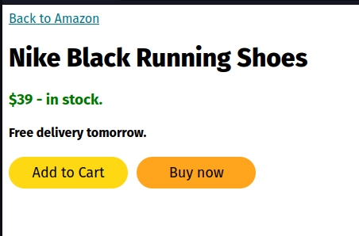

🔗 Resource link - https://github.com/SuperSimpleDev/html-css-course-2022/tree/main/1-exercise-solutions/lesson-01
1. started a course on HTML & CSS basics to expert.

###### Super Basics -
### Code
```
<button>Hello</button>
```
<p>paragraph of text</p>
![[basic html knowledge.jpg]]

# Making Buttons


```
<style>

.subscribe-button{

background-color: rgb(200, 0, 0);

color: white;

border: none;

height: 36px;

width: 105px;

border-radius: 2px;

cursor: pointer;

margin-right: 8px;

}

.join{

background-color: white;

color: rgb(0, 204, 255);

border-color: rgb(0, 204, 255);

border-style: solid;

border-width: 1px;

height: 36px;

width: 62px;

border-radius: 2px;

cursor: pointer;

margin-right: 8px;

}

.tweet{

background-color: rgb(0, 110, 255);

color: white;

border: none;

height: 36px;

width: 70px;

border-radius: 50px;

cursor: pointer;

font-weight: bold;

font-size: 15px;

}

</style>

<button class="subscribe-button">

SUBSCRIBE

</button>

<button class="join">

JOIN

</button>

<button class="Tweet">

Tweet

</button>
```


# Buttons - Exercise 2


```
<style>

.requestnow{

background-color: black;

color: white;

height: 40px;

width: 110px;

border: none;

margin-left: 5px;

margin-right: 5px;

border-radius: 2px;

}

.addtocart{

background-color: rgb(255,216,20);

color: black;

height: 40px;

width: 150px;

border: none;

border-radius: 50px;

margin-left: 5px;

margin-right: 5px;

}

.signup{

background-color: rgb(46,164,79);

color: white;

height: 40px;

width: 95px;

border: none;

border-radius: 8px;

margin-left: 5px;

margin-right: 5px;

font-weight: bold;

font-size: 16px;

}

.getstarted{

background-color: rgb(121,82,179);

color: white;

height: 40px;

width: 110px;

border: none;

border-radius: 4px;

margin-left: 5px;

margin-right: 5px;

font-weight: bold;

font-size: 14px;

}

.download{

background-color: white;

color: rgb(108,117,125);

height: 40px;

width: 110px;

border-style: solid;

border-color: rgb(108,117,125);

border-radius: 4px;

margin-left: 5px;

margin-right: 5px;

font-weight: bold;

font-size: 14px;

}

.aocw{

background-color: rgb(10,102,194);

color: white;

height: 40px;

width: 250px;

border: none;

border-radius: 50px;

margin-left: 5px;

margin-right: 5px;

font-weight: bold;

font-size: 16px;

}

.save{

background-color: white;

color: rgb(10,102,194);

height: 40px;

width: 80px;

border-style: solid;

border-color: rgb(10,102,194);

border-radius: 50px;

margin-left: 5px;

margin-right: 5px;

font-weight: bold;

font-size: 16px;

margin-top: 10px;

}

</style>

  

<button class="requestnow">

Request Now

</button>

<button class="addtocart">

Add to Cart

</button>

<button class="signup">

Sign up

</button>

<button class="getstarted">

Get started

</button>

<button class="download">

download

</button>

<button class="aocw">

Apply on company website

</button>

<button class="save">

Save

</button>
```

# Exercise 2f -


```
<style>

h1{

font-weight: 800;

}

a{

color: rgb(0,113,133);

}

h3{

color: rgb(0,118,0);

}

.atc{

background-color: rgb(255,216,20);

color: black;

width: 150px;

height: 40px;

font-size: 18px;

border: none;

border-radius: 50px;

cursor: pointer;

margin-right: 7px;

}

.Buynow{

background-color: rgb(255,164,28);

color: black;

width: 150px;

height: 40px;

font-size: 18px;

border: none;

border-radius: 50px;

cursor: pointer;

}

</style>

<a href="amazon.com">Back to Amazon</a>

<h1>Nike Black Running Shoes</h1>

<h3>$39 - in stock.</h3>

<h4>Free delivery tomorrow.</h4>

<button class="atc">Add to Cart</button>

<Button class="Buynow">Buy now</Button>
```
---
