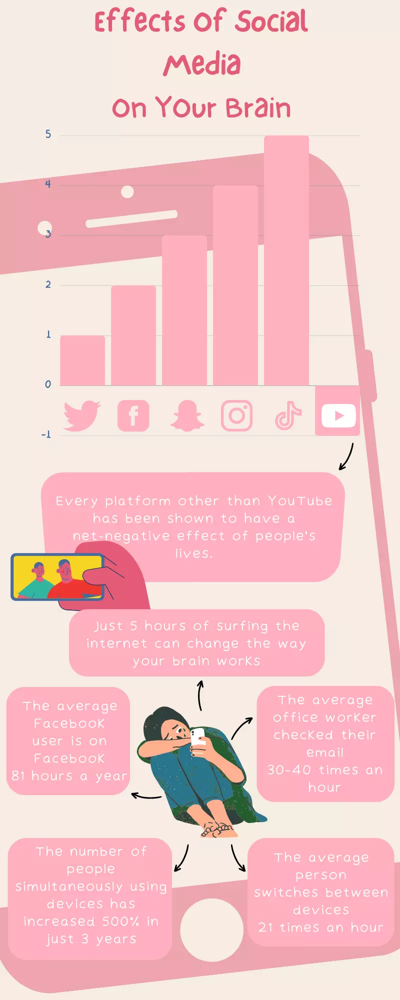
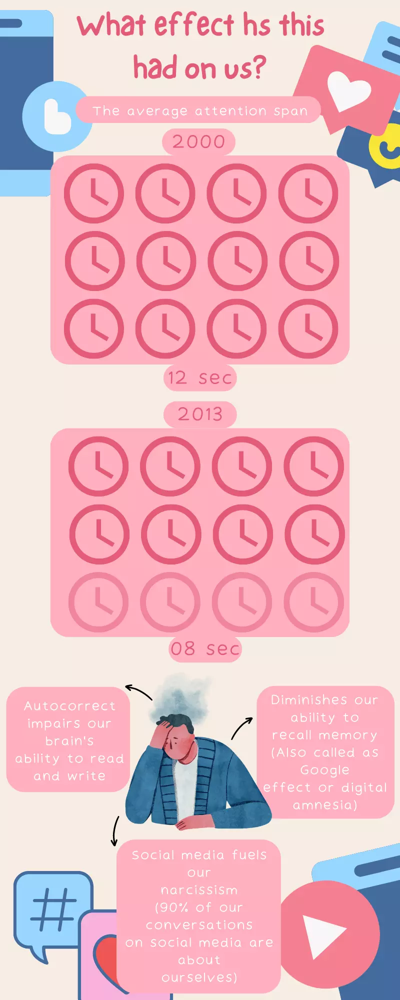

Here's a bit of an intro. The reason I uninstalled all my social media apps was with the realization that I might be too addicted to using these apps on a daily basis. The problem with any kind of addiction is that you don't realize that you're addicted. You'd see examples of these everywhere. Ask a chain smoker if they can stop smoking? And the answer will be something like, **"I can stop whenever I want, it's just that I don't want to stop yet!"**.

Not many people realize just how grave their problem is, but if you have even a little awareness, you might be able to understand that you're too attached to something. Once you have that doubt, you can probe it further. You can test if you're addicted to something or not simply by not doing it, in my case, not using social media.

## Why Change?
This mindset change happened when I read somewhere,**"Don't be a slave to pleasures"**. I think it was a quote from Marcus Aurelius. Even though the topic was not about social media. That thing was stuck in my mind.

The fact is that quote can be applied to anything in life. When you think about it, you'd never want to be a salve to anything. Why live a life where you're addicted to things? Why become a slave knowingly when you can have freedom? Just why give in to these things and live a mediocre life at best?

You might argue, **"Everything is OK if done in moderation!"** You might be right, but to know if you're right or not you'd have to stop using it completely and see the differences, and then figure out if moderation is something for you or not. For me, it was not, and here are the results of not using social media for 6 months.

## A Bit About Habits And Addictions
Here's what I want to explain. _**There's a difference between habits and addictions.**_

Having habits in life is a necessary thing. You can get a lot of things done once you've made them your habits. Habits make your life easier. They are there to help you put in the effort, while at the same time tying in the action of doing something mindlessly.

For example, exercising every day. Even though you may not like it, but if you've made it your habit, you'll get up and exercise even if it doesn't feel at the moment. Because in the long run, good habits have a positive effect. **The only difference between good and bad habits is that good habits help move closer to your goals, while bad ones move you further from them.**

When you think about addictions, they often don't feel very good. So with the example of social media, You don't necessarily feel good after using it. You don't feel "awesome" scrolling through posts mindlessly for hours, and that's one thing we need to understand. **Addictions are automatic responses programmed in our heads, they don't make you feel good, they are just like a broken piece of software you can't get rid of.**

Addictions can also become a crazy search of novel experiences in extreme cases. One example I can give is of porn addicts. Once they are addicted, they can't get the satisfaction from just watching normal porn, this happens when the brain is so used to the stimulation that you can't get enough dopamine release from the said experience. This makes them want to watch more and more extreme kinds of porn in order to get the same intensity of **HIT!**.

This is the same with social media as well. When you can't get enough of it, you use it more and more. Scrolling endlessly to find something entertaining enough for you, or trying for hours to get that perfect selfie.

## Here's What Changed
After uninstalling social media apps from my phone on **8th of May 2022**. The first few days were not good at all. I had a habit of randomly opening Instagram and scrolling, just seeing what is going on with everyone and everything that I'd been following. This had become such a habit that I'd do it mindlessly in my free time.

After the first few days of feeling like shit, my brain was finally catching up and starting to forget to subconsciously check on Instagram several times a day. Once I got to that point, I'd realized that I might never go back as there was no allure to see what was going on, on Instagram or any other place anymore. Once that attraction dies, so does the addiction.

As for keeping up with people. I realized that it's fairly easy to keep in contact with the people who you actually care about and want to be close to.

And with that comes more time and mindfulness. Now that I wasn't in the same mindset, I could think better. It's a bit harder to explain but, you can really think once you're not constantly looking to distract yourself with social media. I was happy to get bored in my free time. (although I'm still using YouTube)

All this has increased my creativity a bit and made me help concentrate better overall. I'm happy to use this spare processing power and time to learn new things and write new things as well.

**Leaving social media has been one of the best things I've done in the last few months!**

